# How variable is HVPT input: Data pipeline


# Prerequisites

Before running this pipeline, you must have already:

1.  [Retrieved the raw mp3 audio
    files](raw-data-retrieval-instructions.md),
2.  [Converted them to wav files](audio-conversion-instructions.md),
3.  [Used Praat to annotate, segment, and extract acoustic
    measurements.](praat-segmentation-instructions.md)

# Read in/Extract data and combine into one dataframe

## Start with VOT duration data

``` r
# function for getting VOT duration
functionDur <- function(x) {
  tg <- tg.read(x)
  int <- which(pluck(tg, "VOT", "label") != "")
  tg.getIntervalDuration(tg, "VOT", int)
}

# get all TextGrid filepaths
paths <- list.files("sound-files", pattern = "[.]TextGrid$", full.names = TRUE)


# make a tibble with the filenames as a column, then map the function onto each to get durations 
filesDf <- tibble(file = paths)

votData <- filesDf |> 
  mutate(vot_duration_ms = map_dbl(file, functionDur))
         
# now rework the filenames using basename()
votData <- votData |> 
  mutate(file = basename(paths), .before = vot_duration_ms)

# extract variables from audio file names
votData <- votData |> 
  separate_wider_regex(
    file,
    patterns = c(
      word = "^[bp].+",
      "_",
      voicing = "voiced|voiceless",
      "_",
      sex = ".",
      "_",
      talker_id = "\\d+",
      "[_.]",
      rest = "\\S+")
  )

# we don't need that rest column
votData <- votData |> 
  select(!c(rest))

# make duration column into ms
votData <- votData |> 
  mutate(vot_duration_ms = vot_duration_ms*1000, .after = talker_id)

# make /b/ VOT negative: it's kind of annoying!
votDataB <- votData |> 
  filter(voicing == "voiced") |> 
  mutate(vot_duration_ms = vot_duration_ms * -1)

votDataP <- votData |> 
  filter(voicing == "voiceless")

votData <- rbind(votDataB, votDataP)

# add condition information
votData <- votData |> 
  mutate(two_talker = ifelse(talker_id == "928" | talker_id == "198", "y", "n"),
         six_talker = ifelse(word != "bacho" & word != "belo" & word != "bicho" & word != "bolo" & word != "bumo" & word != "pacho" & word != "pelo" & word != "picho" & word != "polo" & word != "pumo", "y", "n"))

# clean col names to be safe
votData <- clean_names(votData)
```

## Move on to formant data

``` r
formantData <- read_delim("sound-files/formant-data.txt")
```

    Rows: 80 Columns: 12
    ── Column specification ────────────────────────────────────────────────────────
    Delimiter: "\t"
    chr (2): Filename, Label_interval
    dbl (9): nInterval, F0, F1, F2, F3, F4, Start_point, Duration_ms, Intensity_dB
    lgl (1): Folder

    ℹ Use `spec()` to retrieve the full column specification for this data.
    ℹ Specify the column types or set `show_col_types = FALSE` to quiet this message.

``` r
# make all column names lowercase for ease/simplicity
colnames(formantData) <- tolower(colnames(formantData))

# duplicate filename so we can extract the vowel
formantData <- formantData |> 
  mutate(file = filename, .before = filename)

# extract the vowel from the filename
formantData <- formantData |> 
  separate_wider_regex(
    file,
    patterns = c(
      initial_stop = "^[bp]",
      vowel = "[aeiou]",
      rest = "\\S+")
  )

# extract info from the filenames we kept: don't mind the bug
formantData <- formantData |> 
  separate_wider_regex(
    filename,
    patterns = c(
      word = "^[bp].+",
      "_",
      voicing = "voiced|voiceless",
      "_",
      sex = ".",
      "_",
      talker_id = "\\d+"
      ),
    too_few = "debug"
  )
```

    Warning: Debug mode activated: adding variables `filename_ok`, `filename_matches`, and
    `filename_remainder`.

``` r
# clean up columns
formantData <- formantData |> 
  select(vowel, word:talker_id, f0:intensity_db)


# normalize formants
formantData <- formantData |> 
  group_by(talker_id) |> 
  mutate(f1lobanov = normLobanov(f1), 
         f2lobanov = normLobanov(f2))

# rename the norm columns
formantData <- formantData |> 
  rename(f1_norm = f1lobanov,
         f2_norm = f2lobanov)

# convert matrix lobanov cols into vectors
formantData$f1_norm <- formantData$f1_norm[,1]
formantData$f2_norm <- formantData$f2_norm[,1]
```

## Join the dataframes

``` r
# join dfs
allData <- formantData |> 
  left_join(votData)
```

    Joining with `by = join_by(word, voicing, sex, talker_id)`

``` r
# fix some names
allData |> 
  rename(vowel_duration_ms = duration_ms,
         vowel_intensity_db = intensity_db)
```

    # A tibble: 80 × 18
    # Groups:   talker_id [6]
       vowel word  voicing sex   talker_id    f0    f1    f2    f3    f4 start_point
       <chr> <chr> <chr>   <chr> <chr>     <dbl> <dbl> <dbl> <dbl> <dbl>       <dbl>
     1 a     bacho voiced  f     928         176   811  1305  2964  3517        2.24
     2 a     bacho voiced  m     198         123   571  1277  2456  3057        2.21
     3 a     baso  voiced  f     007         140   786  1239  2413  3338        2.14
     4 a     baso  voiced  f     863         160   984  1519  2763  3953        2.23
     5 a     baso  voiced  f     928         176   708  1179  2163  3101        2.30
     6 a     baso  voiced  m     198         122   575  1189  2421  3394        2.22
     7 a     baso  voiced  m     355         153   789  1251  2745  3331        2.19
     8 a     baso  voiced  m     377          88   725  1101  2592  3589        2.26
     9 e     belo  voiced  f     928         212   453  2169  2853  3751        2.22
    10 e     belo  voiced  m     198         129   429  1652  2278  3166        2.23
    # ℹ 70 more rows
    # ℹ 7 more variables: vowel_duration_ms <dbl>, vowel_intensity_db <dbl>,
    #   f1_norm <dbl>, f2_norm <dbl>, vot_duration_ms <dbl>, two_talker <chr>,
    #   six_talker <chr>

``` r
# change to factor
allData$voicing <- as.factor(allData$voicing)
allData$sex <- as.factor(allData$sex)
allData$talker_id <- as.factor(allData$talker_id)
allData$vowel <- as.factor(allData$vowel)
```

## Write cleaned data to new file

``` r
# note that this is only the cleaned-up version of the full dataset
write_csv(allData, "stimuli-acoustics.csv")
```

# Analyses

## VOT

``` r
# make some labels
voicing_labels <- c(
  `voiced` = "/b/",
  `voiceless` = "/p/"
)

# plot
allData |> 
  ggplot(aes(x = talker_id, y = vot_duration_ms, fill = sex)) +
  geom_boxplot() +
  ylim(NA, 100) +
  scale_y_continuous(breaks = c(-200, -150, -100, -50, 0, 50, 100)) +
  scale_fill_manual(values = c("skyblue", "lightgoldenrod")) +
  theme_bw() +
  labs(x = "Talker",
       y = "VOT duration (ms)",
       title = "VOT duration (ms) for /p/-/b/ by talker (all tokens)",
       fill = "Gender") +
  facet_wrap(~voicing, ncol = 2, labeller = labeller(voicing = voicing_labels))
```

    Scale for y is already present.
    Adding another scale for y, which will replace the existing scale.

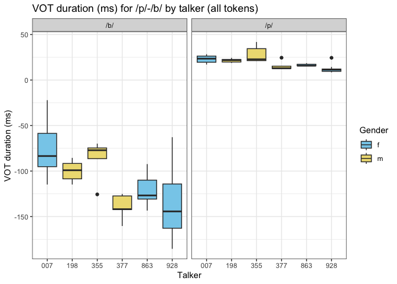

``` r
# make a table of values
allData |> 
  group_by(talker_id, voicing) |> 
  summarize(mean_vot = mean(vot_duration_ms),
            sd_vot = sd(vot_duration_ms))
```

    `summarise()` has grouped output by 'talker_id'. You can override using the
    `.groups` argument.

    # A tibble: 12 × 4
    # Groups:   talker_id [6]
       talker_id voicing   mean_vot sd_vot
       <fct>     <fct>        <dbl>  <dbl>
     1 007       voiced       -74.8  35.8 
     2 007       voiceless     23.0   4.68
     3 198       voiced       -99.8  10.1 
     4 198       voiceless     21.5   1.93
     5 355       voiced       -86.7  22.6 
     6 355       voiceless     28.3   9.42
     7 377       voiced      -139.   14.2 
     8 377       voiceless     15.6   5.09
     9 863       voiced      -121.   19.8 
    10 863       voiceless     16.5   1.36
    11 928       voiced      -136.   37.9 
    12 928       voiceless     12.3   4.63

``` r
allData |> 
  filter(voicing == "voiced") |> 
  ggplot(aes(x = vowel, y = vot_duration_ms)) +
  geom_boxplot() +
  theme_bw() +
  labs(x = "Vowel",
       y = "VOT duration (ms)",
       title = "VOT duration (ms) for /b/ by following vowel (all tokens)")
```

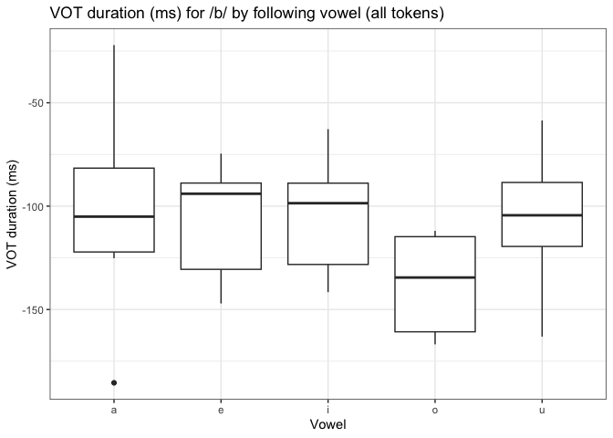

``` r
allData |> 
  filter(voicing == "voiceless") |> 
  ggplot(aes(x = vowel, y = vot_duration_ms)) +
  geom_boxplot() +
  theme_bw() +
  labs(x = "Vowel",
       y = "VOT duration (ms)",
       title = "VOT duration (ms) for /p/ by following vowel (all tokens)")
```

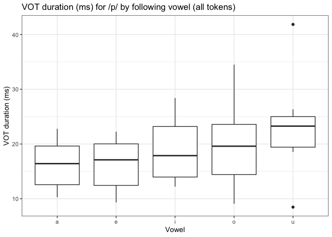

``` r
allData |> 
  ggplot(aes(x = vowel, y = vot_duration_ms)) +
  geom_boxplot() +
  theme_bw() +
  labs(x = "Vowel",
       y = "VOT duration (ms)",
       title = "VOT duration (ms) for /b/-/p/ by following vowel (all tokens)") +
  facet_wrap(~voicing, ncol = 2, labeller = labeller(voicing = voicing_labels))
```

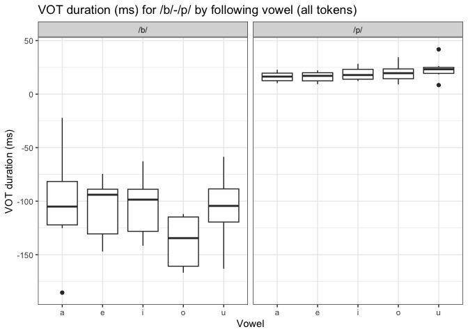

``` r
# make data longer so each row has condition info
allDataLong <- allData |> 
  pivot_longer(!vowel:vot_duration_ms, names_to = "condition", values_to = "condition_true")

allDataLong$condition <- paste(allDataLong$condition, allDataLong$condition_true, sep = "_")

# limit to only "yes" conditions
allDataLongConditions <- allDataLong |> 
  filter(condition %in% c("six_talker_y", "two_talker_y"))

# make some labels
condition_labels <- c(
  `six_talker_y` = "six-talker",
  `two_talker_y` = "two-talker"
)

# plot
allDataLongConditions |> 
  ggplot(aes(x = talker_id, y = vot_duration_ms, fill = sex)) +
  geom_boxplot() +
  scale_fill_manual(values = c("skyblue", "lightgoldenrod")) +
  theme_bw() +
  labs(x = "Talker",
       y = "VOT duration (ms)",
       title = "VOT duration (ms) by talker and condition",
       fill = "Gender") +
  facet_wrap(vars(condition, voicing), labeller = labeller(condition = condition_labels, voicing = voicing_labels))
```

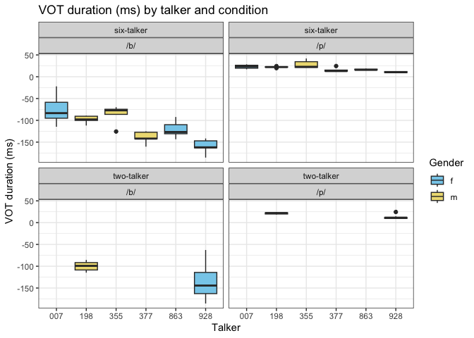

``` r
allDataLongConditions |> 
  ggplot(aes(x = voicing, y = vot_duration_ms)) +
  geom_boxplot() +
  theme_bw() +
  labs(x = "Stop",
       y = "VOT duration (ms)",
       title = "VOT duration (ms) by condition") +
  facet_wrap(vars(condition), labeller = labeller(condition = condition_labels))
```

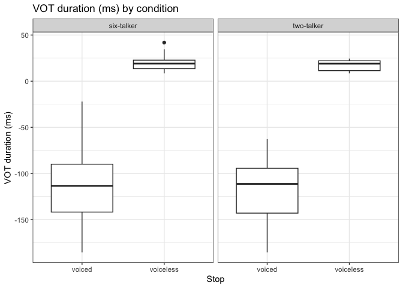

# Vowel Formants

- NOTE: Vowel space code was developed using [Dr. Marissa Barlaz’s Vowel
  Normalization
  Workshop.](https://marissabarlaz.github.io/portfolio/vowelnormalization/)

``` r
allData |> 
  ggplot(aes(x = f2_norm, y = f1_norm, color = vowel)) +
  geom_point(aes(shape = vowel), alpha = 0.3) +
  stat_ellipse() +
  theme_bw() +
  scale_x_reverse() +
  scale_y_reverse() +
  geom_text(data = formantData |> 
  group_by(vowel) |> 
  summarize_at(vars(f1_norm:f2_norm), mean, na.rm = TRUE), aes(label = vowel), size = 8) +
  labs(x = "F2 (Lobanov-transformed)",
       y = "F1 (Lobanov-transformed)",
       title = "Vowel space: All tokens")
```


``` r
allData |> 
  ggplot(aes(x = f2_norm, y = f1_norm, color = vowel)) +
  geom_point(aes(shape = vowel), alpha = 0.3) +
  theme_bw() +
  scale_x_reverse() +
  scale_y_reverse() +
  geom_text(data = formantData |> 
  group_by(vowel) |> 
  summarize_at(vars(f1_norm:f2_norm), mean, na.rm = TRUE), aes(label = vowel), size = 8) +
  labs(x = "F2 (Lobanov-transformed)",
       y = "F1 (Lobanov-transformed)",
       title = "Vowel space by talker") +
  facet_wrap(~talker_id, ncol = 2)
```

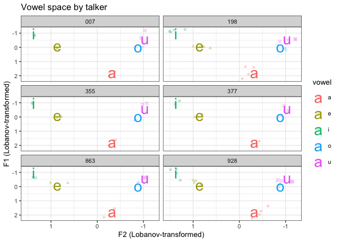

``` r
# make a table
allData |> 
  group_by(vowel) |> 
  summarize(mean_f1 = mean(f1_norm),
            sd_f1 = sd(f1_norm),
            mean_f2 = mean(f2_norm),
            sd_f2 = mean(f2_norm))
```

    # A tibble: 5 × 5
      vowel mean_f1 sd_f1 mean_f2  sd_f2
      <fct>   <dbl> <dbl>   <dbl>  <dbl>
    1 a      1.75   0.280  -0.322 -0.322
    2 e     -0.123  0.174   0.860  0.860
    3 i     -0.964  0.239   1.37   1.37 
    4 o     -0.0432 0.184  -0.882 -0.882
    5 u     -0.618  0.239  -1.03  -1.03 

``` r
# unfortunately this plot ends up practically unreadable
allData |> 
  ggplot(aes(x = f2_norm, y = f1_norm, color = vowel)) +
  geom_point(aes(shape = vowel), alpha = 0.3) +
  theme_bw() +
  scale_x_reverse() +
  scale_y_reverse() +
  geom_text(data = formantData |> 
  group_by(vowel) |> 
  summarize_at(vars(f1_norm:f2_norm), mean, na.rm = TRUE), aes(label = vowel), size = 8) +
  labs(x = "F2 (Lobanov-transformed)",
       y = "F1 (Lobanov-transformed)",
       title = "Vowel space by talker") +
  facet_wrap(vars(talker_id, voicing), ncol = 2, labeller = labeller(voicing = voicing_labels))
```

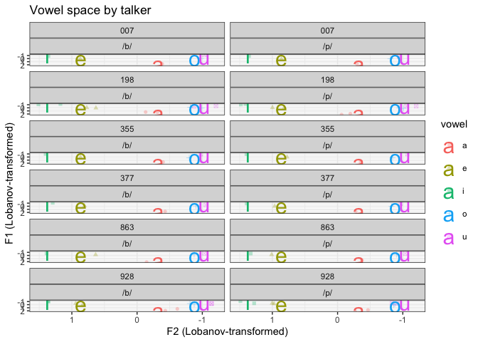

``` r
allData |> 
ggplot(aes(x = f2_norm, y = f1_norm, color = vowel)) +
  geom_point(aes(shape = vowel), alpha = 0.3) +
  stat_ellipse() +
  theme_bw() +
  scale_x_reverse() +
  scale_y_reverse() +
  geom_text(data = formantData |> 
  group_by(vowel) |> 
  summarize_at(vars(f1_norm:f2_norm), mean, na.rm = TRUE), aes(label = vowel), size = 8) +
  labs(x = "F2 (Lobanov-transformed)",
       y = "F1 (Lobanov-transformed)",
       title = "Vowel space by stop (/b/ and /p/)") +
  facet_wrap(~voicing, ncol = 2, labeller = labeller(voicing = voicing_labels))
```

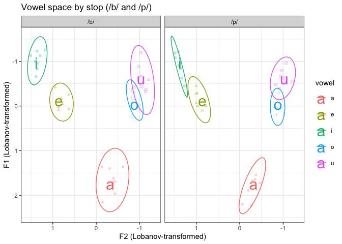

``` r
allData |> 
ggplot(aes(x = f2_norm, y = f1_norm, color = vowel)) +
  geom_point(aes(shape = vowel), alpha = 0.3) +
  stat_ellipse() +
  theme_bw() +
  scale_x_reverse() +
  scale_y_reverse() +
  geom_text(data = formantData |> 
  group_by(vowel) |> 
  summarize_at(vars(f1_norm:f2_norm), mean, na.rm = TRUE), aes(label = vowel), size = 8) +
  labs(x = "F2 (Lobanov-transformed)",
       y = "F1 (Lobanov-transformed)",
       title = "Vowel space by gender") +
  facet_wrap(~sex, ncol = 2)
```

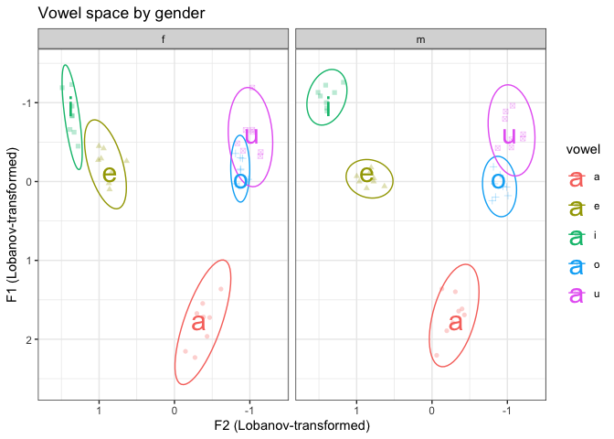

``` r
# female talkers
allData |> 
  filter(sex == "f") |> 
ggplot(aes(x = f2_norm, y = f1_norm, color = vowel)) +
  geom_point(aes(shape = vowel), alpha = 0.3) +
  theme_bw() +
  scale_x_reverse() +
  scale_y_reverse() +
  geom_text(data = formantData |> 
  group_by(vowel) |> 
  summarize_at(vars(f1_norm:f2_norm), mean, na.rm = TRUE), aes(label = vowel), size = 8) +
  labs(x = "F2 (Lobanov-transformed)",
       y = "F1 (Lobanov-transformed)",
       title = "Vowel space by gender") +
  facet_wrap(~talker_id, ncol = 2)
```

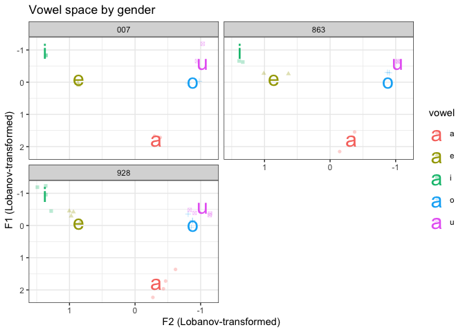

``` r
# male talkers
allData |> 
  filter(sex == "m") |> 
ggplot(aes(x = f2_norm, y = f1_norm, color = vowel)) +
  geom_point(aes(shape = vowel), alpha = 0.3) +
  theme_bw() +
  scale_x_reverse() +
  scale_y_reverse() +
  geom_text(data = formantData |> 
  group_by(vowel) |> 
  summarize_at(vars(f1_norm:f2_norm), mean, na.rm = TRUE), aes(label = vowel), size = 8) +
  labs(x = "F2 (Lobanov-transformed)",
       y = "F1 (Lobanov-transformed)",
       title = "Vowel space by gender") +
  facet_wrap(~talker_id, ncol = 2)
```

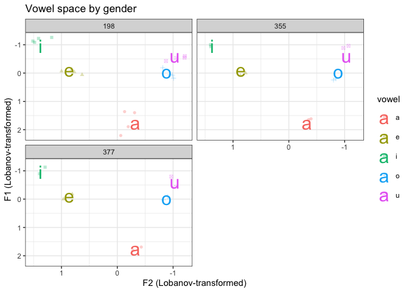

``` r
allData |> 
ggplot(aes(x = f2_norm, y = f1_norm, color = vowel)) +
  geom_point(aes(shape = vowel), alpha = 0.3) +
  stat_ellipse() +
  theme_bw() +
  scale_x_reverse() +
  scale_y_reverse() +
  geom_text(data = formantData |> 
  group_by(vowel) |> 
  summarize_at(vars(f1_norm:f2_norm), mean, na.rm = TRUE), aes(label = vowel), size = 8) +
  labs(x = "F2 (Lobanov-transformed)",
       y = "F1 (Lobanov-transformed)",
       title = "Vowel space by gender and stop (/b/ and /p/") +
  facet_wrap(vars(sex, voicing), ncol = 2, labeller = labeller(voicing = voicing_labels))
```

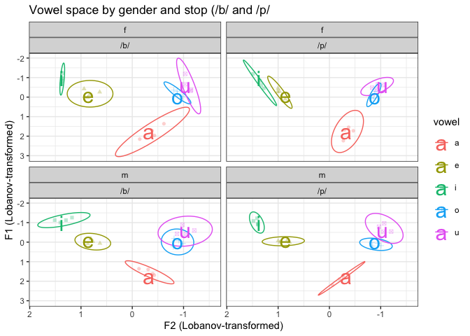

``` r
allDataLongConditions |> 
ggplot(aes(x = f2_norm, y = f1_norm, color = vowel)) +
  geom_point(aes(shape = vowel), alpha = 0.3) +
  stat_ellipse() +
  theme_bw() +
  scale_x_reverse() +
  scale_y_reverse() +
  geom_text(data = formantData |> 
  group_by(vowel) |> 
  summarize_at(vars(f1_norm:f2_norm), mean, na.rm = TRUE), aes(label = vowel), size = 8) +
  labs(x = "F2 (Lobanov-transformed)",
       y = "F1 (Lobanov-transformed)",
       title = "Vowel space by condition") +
  facet_wrap(~condition, ncol = 2, labeller = labeller(condition = condition_labels))
```

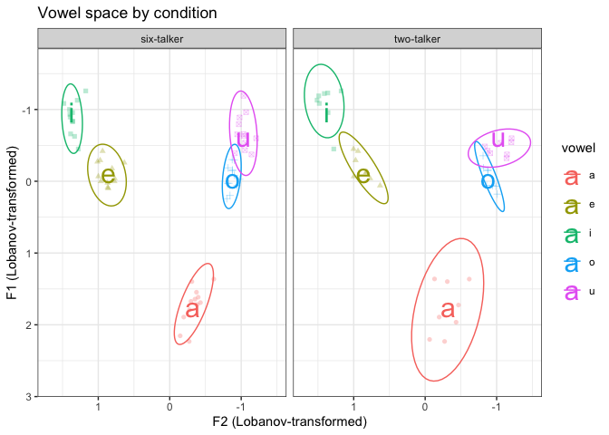

``` r
allDataLongConditions |> 
ggplot(aes(x = f2_norm, y = f1_norm, color = vowel)) +
  geom_point(aes(shape = vowel), alpha = 0.3) +
  stat_ellipse() +
  theme_bw() +
  scale_x_reverse() +
  scale_y_reverse() +
  geom_text(data = formantData |> 
  group_by(vowel) |> 
  summarize_at(vars(f1_norm:f2_norm), mean, na.rm = TRUE), aes(label = vowel), size = 8) +
  labs(x = "F2 (Lobanov-transformed)",
       y = "F1 (Lobanov-transformed)",
       title = "Vowel space by condition") +
  facet_wrap(vars(condition, voicing), ncol = 2, labeller = labeller(condition = condition_labels, voicing = voicing_labels))
```

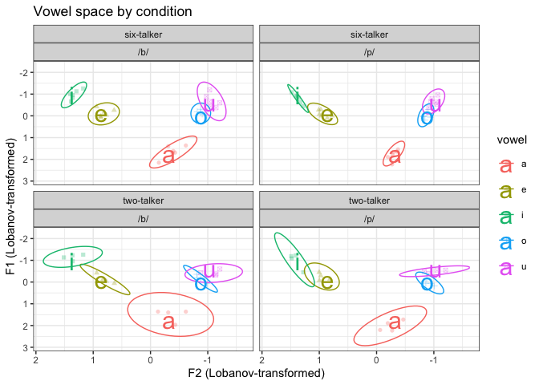

``` r
allDataLongConditions |> 
ggplot(aes(x = f2_norm, y = f1_norm, color = vowel)) +
  geom_point(aes(shape = vowel), alpha = 0.3) +
  stat_ellipse() +
  theme_bw() +
  scale_x_reverse() +
  scale_y_reverse() +
  geom_text(data = formantData |> 
  group_by(vowel) |> 
  summarize_at(vars(f1_norm:f2_norm), mean, na.rm = TRUE), aes(label = vowel), size = 8) +
  labs(x = "F2 (Lobanov-transformed)",
       y = "F1 (Lobanov-transformed)",
       title = "Vowel space by condition") +
  facet_wrap(vars(condition, sex), ncol = 2, labeller = labeller(condition = condition_labels))
```

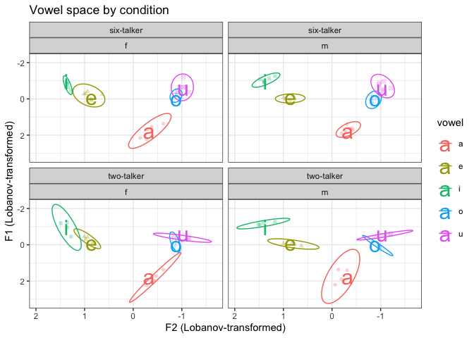

``` r
allDataLongConditions |> 
  filter(talker_id == "198" | talker_id == "928") |> 
  ggplot(aes(x = f2_norm, y = f1_norm, color = vowel)) +
  geom_point(aes(shape = vowel), alpha = 0.3) +
  stat_ellipse() +
  theme_bw() +
  scale_x_reverse() +
  scale_y_reverse() +
  geom_text(data = formantData |> 
  group_by(vowel) |> 
  summarize_at(vars(f1_norm:f2_norm), mean, na.rm = TRUE), aes(label = vowel), size = 8) +
  labs(x = "F2 (Lobanov-transformed)",
       y = "F1 (Lobanov-transformed)",
       title = "Vowel spaces for Talker 198 and Talker 928") +
  facet_wrap(~condition, ncol = 2, labeller = labeller(condition = condition_labels))
```

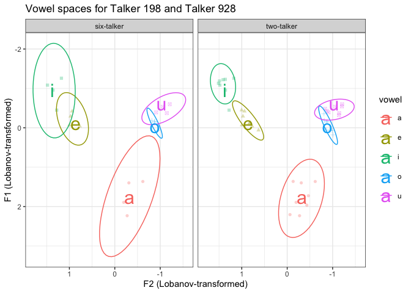

``` r
allDataLongConditions |> 
  filter(talker_id == "198" | talker_id == "928") |> 
  ggplot(aes(x = f2_norm, y = f1_norm, color = vowel)) +
  geom_point(aes(shape = vowel), alpha = 0.3) +
  theme_bw() +
  scale_x_reverse() +
  scale_y_reverse() +
  geom_text(data = formantData |> 
  group_by(vowel) |> 
  summarize_at(vars(f1_norm:f2_norm), mean, na.rm = TRUE), aes(label = vowel), size = 8) +
  labs(x = "F2 (Lobanov-transformed)",
       y = "F1 (Lobanov-transformed)",
       title = "Vowel space for Talker 198 and Talker 928 by stop") +
  facet_wrap(vars(condition, voicing), ncol = 2, labeller = labeller(condition = condition_labels, voicing = voicing_labels))
```

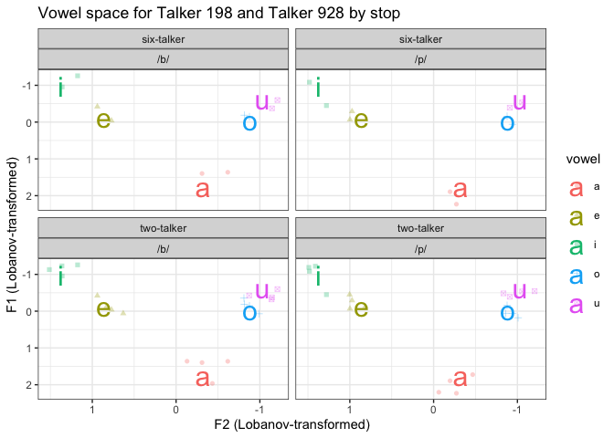

\#f0

``` r
allData |> 
  ggplot(aes(x = talker_id, y = f0, fill = sex)) +
  geom_boxplot() +
  scale_fill_manual(values = c("skyblue", "lightgoldenrod")) +
  theme_bw() +
  labs(x = "Talker",
       y = "f0 (Hz)",
       title = "f0 (Hz) by talker",
       fill = "Gender") +
  facet_wrap(~voicing, ncol = 2, labeller = labeller(voicing = voicing_labels))
```

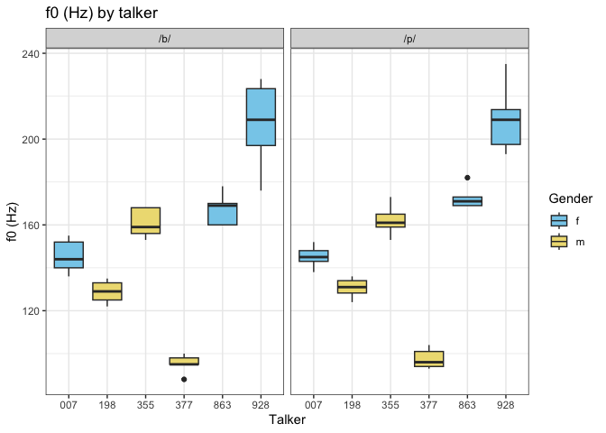

``` r
allData |> 
  ggplot(aes(x = vowel, y = f0, fill = sex)) +
  geom_boxplot() +
  scale_fill_manual(values = c("skyblue", "lightgoldenrod")) +
  theme_bw() +
  labs(x = "Vowel",
       y = "f0 (Hz)",
       title = "f0 (Hz) by gender and vowel",
       fill = "Gender") +
  facet_wrap(~voicing, ncol = 2, labeller = labeller(voicing = voicing_labels))
```

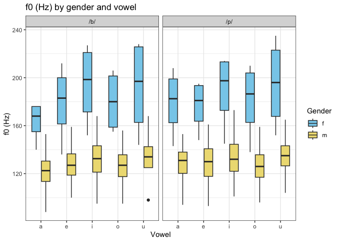

``` r
allDataLongConditions |> 
  ggplot(aes(x = voicing, y = f0, fill = sex)) +
  geom_boxplot() +
  scale_fill_manual(values = c("skyblue", "lightgoldenrod")) +
  theme_bw() +
  labs(x = "Stop (voicing)",
       y = "f0 (Hz)",
       title = "f0 (Hz) by condition",
       fill = "Gender") +
  facet_wrap(~condition, ncol = 2, labeller = labeller(condition = condition_labels))
```

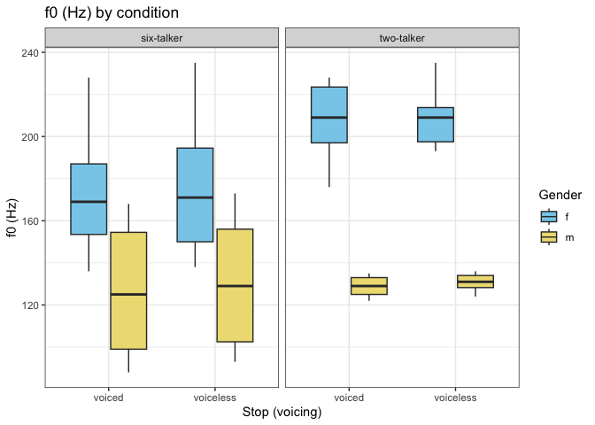

# Model

Using binary logistic regression to predict voicing (voiced = “1”,
voiceless = “0”) from other predictor variables.

## Dummy code data

``` r
# dummy code voicing predictor
allDataModel <- allData
allDataModel$voicing <- fct_recode(allDataModel$voicing,
                                   "0" = "voiceless",
                                   "1" = "voiced")
```

## Create models

``` r
# predicting voicing from f0 of vowel
modelf0 <- glm(formula = voicing ~ f0, family = binomial, data = allDataModel)
summary(modelf0)
```


    Call:
    glm(formula = voicing ~ f0, family = binomial, data = allDataModel)

    Coefficients:
                 Estimate Std. Error z value Pr(>|z|)
    (Intercept) -0.241293   0.957182  -0.252    0.801
    f0           0.001547   0.005968   0.259    0.795

    (Dispersion parameter for binomial family taken to be 1)

        Null deviance: 110.90  on 79  degrees of freedom
    Residual deviance: 110.84  on 78  degrees of freedom
    AIC: 114.84

    Number of Fisher Scoring iterations: 3

``` r
# predicting voicing from f1 of vowel
modelf1 <- glm(formula = voicing ~ f1_norm, family = binomial, data = allDataModel)
summary(modelf1)
```


    Call:
    glm(formula = voicing ~ f1_norm, family = binomial, data = allDataModel)

    Coefficients:
                 Estimate Std. Error z value Pr(>|z|)
    (Intercept) 3.576e-05  2.238e-01    0.00    1.000
    f1_norm     7.920e-02  2.330e-01    0.34    0.734

    (Dispersion parameter for binomial family taken to be 1)

        Null deviance: 110.90  on 79  degrees of freedom
    Residual deviance: 110.79  on 78  degrees of freedom
    AIC: 114.79

    Number of Fisher Scoring iterations: 3

``` r
sessionInfo()
```

    R version 4.5.1 (2025-06-13)
    Platform: aarch64-apple-darwin20
    Running under: macOS Sonoma 14.7.3

    Matrix products: default
    BLAS:   /Library/Frameworks/R.framework/Versions/4.5-arm64/Resources/lib/libRblas.0.dylib 
    LAPACK: /Library/Frameworks/R.framework/Versions/4.5-arm64/Resources/lib/libRlapack.dylib;  LAPACK version 3.12.1

    locale:
    [1] en_US.UTF-8/en_US.UTF-8/en_US.UTF-8/C/en_US.UTF-8/en_US.UTF-8

    time zone: America/New_York
    tzcode source: internal

    attached base packages:
    [1] stats     graphics  grDevices utils     datasets  methods   base     

    other attached packages:
     [1] phonR_1.0-7     janitor_2.2.1   rPraat_1.3.2-1  lubridate_1.9.4
     [5] forcats_1.0.0   stringr_1.5.1   dplyr_1.1.4     purrr_1.1.0    
     [9] readr_2.1.5     tidyr_1.3.1     tibble_3.3.0    ggplot2_4.0.0  
    [13] tidyverse_2.0.0 readxl_1.4.5   

    loaded via a namespace (and not attached):
     [1] utf8_1.2.6         generics_0.1.4     stringi_1.8.7      hms_1.1.3         
     [5] digest_0.6.37      magrittr_2.0.4     evaluate_1.0.4     grid_4.5.1        
     [9] timechange_0.3.0   RColorBrewer_1.1-3 fastmap_1.2.0      cellranger_1.1.0  
    [13] jsonlite_2.0.0     scales_1.4.0       cli_3.6.5          rlang_1.1.6       
    [17] crayon_1.5.3       bit64_4.6.0-1      withr_3.0.2        yaml_2.3.10       
    [21] tools_4.5.1        parallel_4.5.1     tzdb_0.5.0         vctrs_0.6.5       
    [25] R6_2.6.1           lifecycle_1.0.4    snakecase_0.11.1   bit_4.6.0         
    [29] MASS_7.3-65        vroom_1.6.5        pkgconfig_2.0.3    pillar_1.11.1     
    [33] gtable_0.3.6       glue_1.8.0         xfun_0.53          tidyselect_1.2.1  
    [37] rstudioapi_0.17.1  knitr_1.50         farver_2.1.2       htmltools_0.5.8.1 
    [41] rmarkdown_2.29     labeling_0.4.3     compiler_4.5.1     S7_0.2.0          
